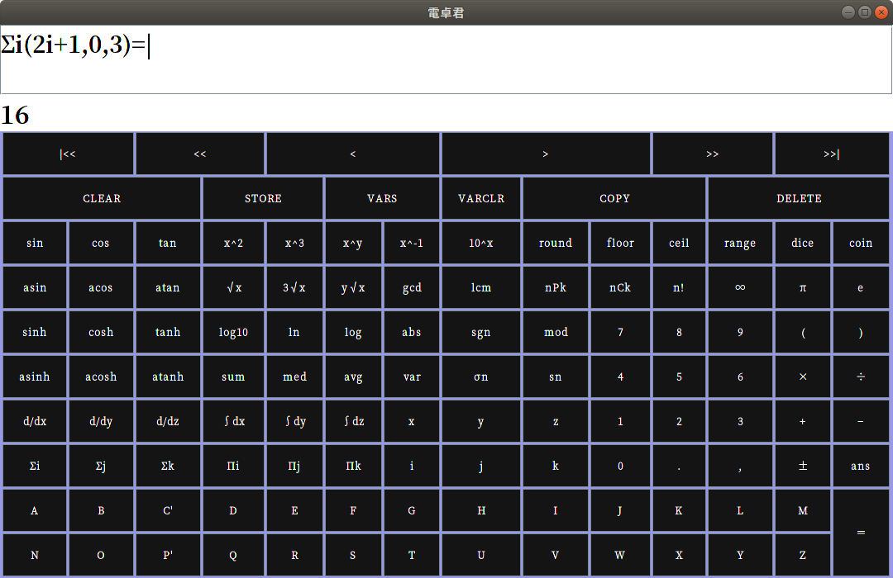

# 電卓君

総和計算や数値積分などを含む多機能関数電卓

[ダウンロード](https://github.com/curegit/dentakun/releases)

## 動作条件

- Java Runtime Environment 8.0 以降

## 実行方法

`dentakun.jar` を実行する

## 使い方

式を入力して演算実行ボタン（＝）を押す

### （例）3+6×2-4 を計算する

1. 「3」を押す
2. 「+」を押す
3. 「6」を押す
4. 「×」を押す
5. 「2」を押す
6. 「−」を押す
7. 「4」を押す
8. 「=」を押す

### 変数と代入

STORE ボタンによる代入（←）を使うとユーザー変数 (A-Z) に値を保持しておくことができる。
変数の値はプログラムを終了しても永続する。

### その他のボタン

- CLEAR: 式を消去する
- VARS: 各ユーザー変数の値を見る
- VARCLR: すべてのユーザー変数を零初期化する
- COPY: 結果をクリップボードにコピーする
- DELETE: カーソル手前の式の要素を削除する

### ホットキー

- Return: 計算を実行する
- Backspace/Delete: カーソル手前の式の要素を削除する
- Esc: 式を消去する
- 数字/テンキーの数字: 各数字を入力する
- テンキーの演算子: 四則演算子を入力する
- Insert: 代入記号を入力する
- 左右方向キー: カーソルを左右に移動させる
- 上下方向キー: カーソルを左右に2つ分移動させる
- 各アルファベット: 各変数記号を入力する
- コンマ: コンマを入力する
- PageUp/PageDown: 式の先頭/末尾へカーソルを移動させる
- キャレット: 指数演算子を入力する
- ハイフン: 負符号を入力する
- 括弧 \[ \]: 括弧を入力する

### 演算子の優先順位

1. 負符号 (-)
2. 根、指数、階乗 (√ ^ !)
3. 組み合わせ、順列 (C P)
4. 乗算、除算、剰余 (× ÷ mod)
5. 加算、減算 (+ −)

### 関数

#### 1引数関数

- abs(x): 絶対値関数
- acos(x): 逆余弦関数
- acosh(x): 逆双曲線余弦関数
- asin(x): 逆正弦関数
- asinh(x): 逆双曲線正弦関数
- atan(x): 逆正接関数
- atanh(x): 逆双曲線正接関数
- ceil(x): 天井関数
- cos(x): 余弦関数
- cosh(x): 双曲線余弦関数
- dice(n): 1 から n までの整数乱数を返す
- floor(x): 床関数
- log10(x): 常用対数関数
- ln(x): 自然対数関数
- range(x): 0 以上 x 未満の乱数を返す
- round(x): 四捨五入して整数を返す
- sgn(x): 符号関数
- sin(x): 正弦関数
- sinh(x): 双曲線正弦関数
- tan(x): 正接関数
- tanh(x): 双曲線正接関数

#### 2引数関数

- coin(a,b): 半分の確率で a を返し残りの半分で b を返す
- gcd(m,n): m と n の最大公約数を返す
- lcm(m,n): m と n の最小公倍数を返す
- log(x,p): p を底とする対数関数
- d/dx(f,a): f の x = a における微分係数を求める関数
- d/dy(f,a): f の y = a における微分係数を求める関数
- d/dz(f,a): f の z = a における微分係数を求める関数

#### 3引数関数

- ∫x(f,a,b): x について区間 [a, b] の定積分を求める関数
- ∫y(f,a,b): y について区間 [a, b] の定積分を求める関数
- ∫z(f,a,b): z について区間 [a, b] の定積分を求める関数
- Πi(f,a,b): i を a から b まで順に動かした f の総乗を求める関数
- Πj(f,a,b): j を a から b まで順に動かした f の総乗を求める関数
- Πk(f,a,b): k を a から b まで順に動かした f の総乗を求める関数
- Σi(f,a,b): i を a から b まで順に動かした f の総和を求める関数
- Σj(f,a,b): j を a から b まで順に動かした f の総和を求める関数
- Σk(f,a,b): k を a から b まで順に動かした f の総和を求める関数

#### 可変長引数関数

- avg(x,...): 平均関数
- med(x,...): 中央値関数
- σn(x,...): 母標準偏差関数
- sn(x,...): 標本標準偏差関数
- sum(x,...): 合計関数
- var(x,...): 母分散関数

## ライセンス

[MIT](LICENSE)
